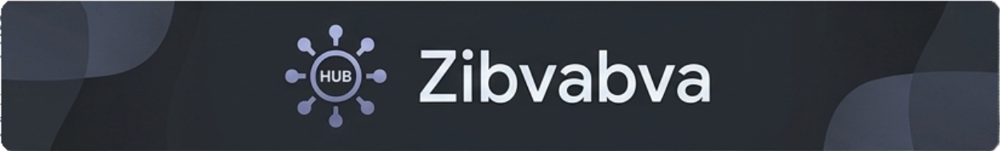

<p align="center">
  
</p>

# Zibvabva - A universal script hub for Roblox

Welcome to my project, Zibvabva - a free script hub for Roblox, which contains scripts of various types: universal, for individual places, other hubs, and much more.

---

## 🚀 Features

This hub was developed by just one person. If you find bugs or scripts from other developers, please write in the issue. It offers the following features:

*   🌐 **Universal Lua:** Support for scripts that work in many places.
*   📍 **Place Specific:** Scenarios optimized for specific maps.
*   🔄 **Regular Updates:** I am constantly adding new features and fixing bugs.
*   ✅ **Easy To Use:** Simple interface, intuitive controls.

---

## 💻 Quick Start

To launch Zibvabva Hub, copy the following code and paste it into your script runner in Roblox:

```lua
https://raw.githubusercontent.com/babyun42/Zibvabva/refs/heads/main/hub.lua
